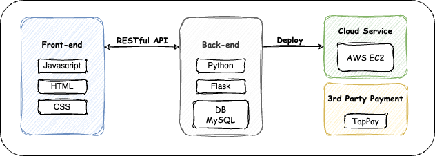
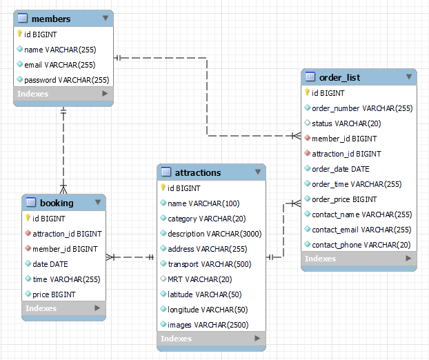

# Taipei-day-trip-website

It is a website where potential visitors can search famous attractions in Taipei for one dat tour, and they can make appointment therein.

Website URL:http://52.74.43.7:3000/

### Test Account
Account:test1000@gmail.com
Password:123456789
### Test Card Number

Card Number: 4242 4242 4242 4242
Valid Date: 01/24
CCV: 123

# Table of Contents

* [Technical Architecture](#techArchi)
* [Front-end Techniques](#frontendTech)
* [Back-end Techniques](#backendTech)
* [Main Features](#mainFeatures)
* [Contacts](#contact)

# Technical Architecture

</img>

# Front-end Techniques

* HTML/CSS/Javascript
* Infinite Scrolling
* Client Side Rendering
* AJAX
* Responsive Web Design (RWD)

# Back-end Techniques

## Web Framework

* Python Flask
* RESTful API

</img>

## Database

* MySQL

</img>

## Cloud Service

* AWS EC2 - Ubuntu

## Third-party Payment

* TapPay

# Main Features

## Search Attractions and Book Trip

## Member Page and Upload Avatar

# Contact

    * Author: Wei-Xiang, Fang
    * Email: ken5475ht@gmail.com